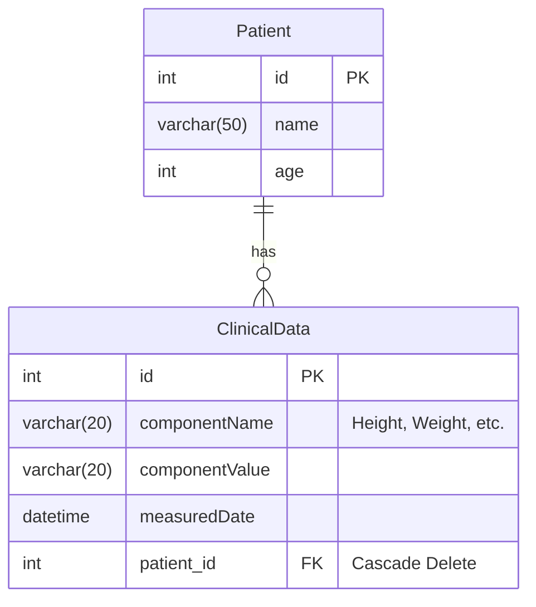
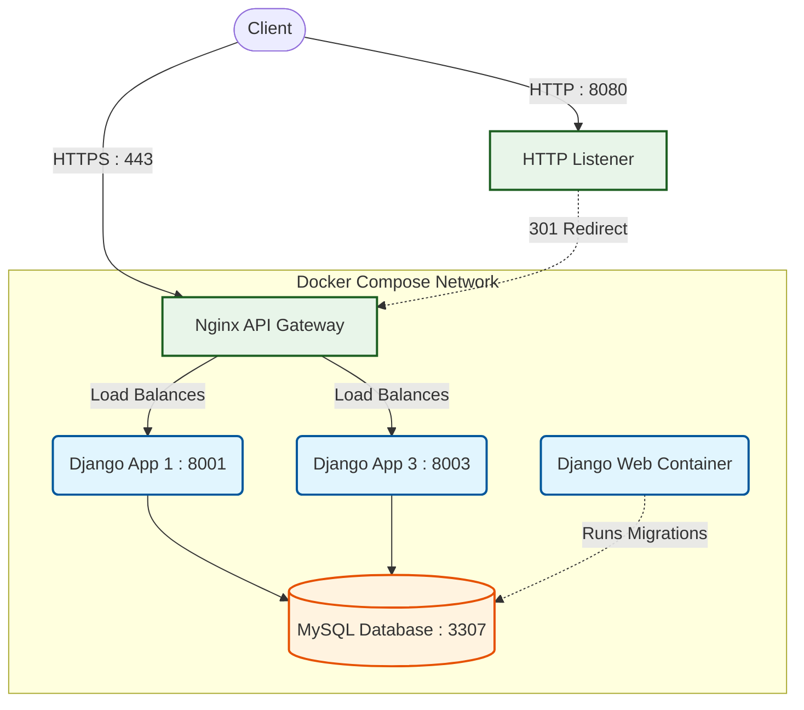

# 🏥 Clinical Data Management System

A production-ready Django-based Clinical Data Management System built with **Docker**, **Nginx API Gateway**, and **CI/CD automation using GitHub Actions**.

This project demonstrates modern backend engineering practices including:

- Django application development
- Docker containerization
- Reverse proxy/API Gateway using Nginx
- Load balancing between multiple Django containers
- CI/CD pipeline automation
- Secure HTTPS configuration
- Scalable deployment architecture

The application manages **patient records** and their associated **clinical data** such as height, weight, blood pressure, and heart rate.

---

# 🚀 Features

## 🩺 Application Features

- Create, update, delete, and view patients
- Add clinical data for patients
- One-to-many relationship between Patient and ClinicalData
- Django Class-Based Views (CBVs)
- Django ModelForms
- Automatic timestamping of clinical records

## 🐳 DevOps Features

- Dockerized Django application
- Docker Compose multi-container setup
- Nginx reverse proxy/API Gateway
- Load balancing across multiple Django containers
- HTTPS enabled with SSL
- CI/CD pipeline using GitHub Actions
- Automated testing during deployment pipeline
- Environment-based configuration

---

# ER Diagram

# 🏗️ System Architecture

Nginx acts as a reverse proxy and load balancer between multiple Django containers.

---

# 📂 Project Structure

```text
clinicalData/
│
├── clinicalApp/
│   ├── migrations/
│   ├── templates/
│   ├── models.py
│   ├── views.py
│   ├── forms.py
│   ├── urls.py
│
├── clinicalData/
│   ├── settings.py
│   ├── urls.py
│
├── Dockerfile
├── docker-compose.yml
├── .dockerignore
├── default.conf
├── requirements.txt
├── manage.py
│
├── .github/
│   └── workflows/
│       └── clinicaldata-ci.yml
```

---

# 🧠 Database Models

## Patient Model

```python
class Patient(models.Model):
    name = models.CharField(max_length=50)
    age = models.IntegerField()
```

## ClinicalData Model

```python
class ClinicalData(models.Model):

    COMPONENT_NAMES = [
        ('Height','Height'),
        ('Weight','Weight'),
        ('Blood Pressure','Blood Pressure'),
        ('HeartRate','Heart Rate')
    ]

    componentName = models.CharField(
        choices=COMPONENT_NAMES,
        max_length=20
    )

    componentValue = models.CharField(max_length=20)

    measuredDate = models.DateTimeField(auto_now_add=True)

    patient = models.ForeignKey(
        Patient,
        on_delete=models.CASCADE
    )
```

Each patient can have multiple clinical records.

---

# 🧾 Forms

```python
class PatientForm(forms.ModelForm):
    class Meta:
        model = Patient
        fields = '__all__'
```

```python
class ClinicalDataForm(forms.ModelForm):
    class Meta:
        model = ClinicalData
        fields = '__all__'
```

---

# 🔧 Views

## Class-Based Views

| View | Purpose |
|---|---|
| `PatientListView` | List all patients |
| `PatientCreateView` | Create new patient |
| `PatientUpdateView` | Update patient |
| `PatientDeleteView` | Delete patient |

## Function-Based View

| View | Purpose |
|---|---|
| `addData` | Add clinical data for patient |

---

# 🌐 URL Endpoints

| Endpoint | Description |
|---|---|
| `/` | List patients |
| `/create/` | Create patient |
| `/update/<id>/` | Update patient |
| `/delete/<id>/` | Delete patient |
| `/clinicaldata/<id>/` | Add clinical data |
| `/admin/` | Django admin panel |

---

# 🐳 Docker Setup

## Build Docker Image

```bash
docker build -t clinicaldata .
```

## Run Container

```bash
docker run -p 8000:8000 clinicaldata
```

---

# 🐙 Docker Compose Setup

The project uses Docker Compose to orchestrate:

- Multiple Django containers
- Nginx API Gateway
- Internal networking

## Start Containers

```bash
docker compose up --build
```

## Run in Detached Mode

```bash
docker compose up -d
```

## Stop Containers

```bash
docker compose down
```

---

# 🌍 Nginx API Gateway

Nginx is configured as:

- Reverse Proxy
- API Gateway
- Load Balancer
- HTTPS Gateway

## Nginx Upstream Configuration

```nginx
upstream django_cluster {
    server app1:8000;
    server app3:8000;
}
```

## HTTPS Reverse Proxy

```nginx
location / {
    proxy_pass http://django_cluster;
}
```

## HTTP → HTTPS Redirection

```nginx
return 301 https://$host$request_uri;
```

---

# 🔐 HTTPS Support

The application supports SSL using self-signed certificates.

## SSL Configuration

```nginx
ssl_certificate /etc/nginx/certs/nginx-selfsigned.crt;
ssl_certificate_key /etc/nginx/certs/nginx-selfsigned.key;
```

---

# ⚙️ CI/CD Pipeline

GitHub Actions is used for Continuous Integration and Continuous Deployment.

## CI/CD Features

- Automatic workflow trigger on push
- Django test execution
- Docker image build
- Dependency installation
- Automated validation pipeline

## Workflow Location

```text
.github/workflows/clinicaldata-ci-cd.yml
```

---

# 🧪 Running Tests

```bash
python manage.py test
```

---

# 💻 Local Development Setup

## 1️⃣ Clone Repository

```bash
git clone https://github.com/your-username/clinical-data-app.git
cd clinical-data-app
```

## 2️⃣ Create Virtual Environment

### Windows

```bash
python -m venv venv
venv\Scripts\activate
```

### Linux/Mac

```bash
python -m venv venv
source venv/bin/activate
```

---

## 3️⃣ Install Dependencies

```bash
pip install -r requirements.txt
```

---

## 4️⃣ Apply Migrations

```bash
python manage.py makemigrations
python manage.py migrate
```

---

## 5️⃣ Run Development Server

```bash
python manage.py runserver
```

---

# 🛠️ Technologies Used

- Python
- Django
- Docker
- Docker Compose
- Nginx
- GitHub Actions
- SQLite
- HTML
- CSS

---

# 📈 Future Improvements

- PostgreSQL integration
- Kubernetes deployment
- AWS deployment
- Redis caching
- JWT Authentication
- Django REST Framework APIs
- Monitoring with Prometheus & Grafana
- Centralized logging
- Auto-scaling infrastructure

---

# 🤝 Contributing

Contributions are welcome.

## Steps

1. Fork repository

2. Create feature branch

```bash
git checkout -b feature-name
```

3. Commit changes

```bash
git commit -m "Added new feature"
```

4. Push changes

```bash
git push origin feature-name
```

5. Open Pull Request

---

# 👨‍💻 Author

**Aranya Majumdar**

- GitHub: https://github.com/aranya-code

---

# ⭐ Project Highlights

This project demonstrates:

- Backend development with Django
- Containerization with Docker
- CI/CD implementation
- Reverse proxy architecture
- API Gateway implementation
- HTTPS setup
- Load balancing
- Scalable system design

A strong showcase project for Backend Developer / DevOps / Software Engineering roles.